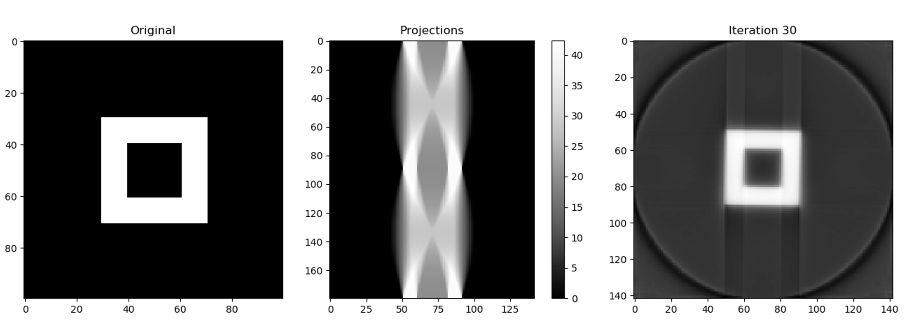

# Ilya
> 3D reconstruction from multiple images

## Key-words
+ Mathematical methods
    + Tomographic reconstruction
    + Radon Transformation(or sinogram), Fourier/Inverse Fourier Transformation, Hilbert Transformation
    + Projection-slice theorem
    + Fourier-Domain Reconstruction Algorithm
    + Back Projection Algorithm
    + Iterative Reconstruction Algorithm
    + Fan-Beam Reconstruction
    + Algebraic reconstruction technique (ART)
    + Kaczmarz method

+ Machine learning based methods
    + Deep learning

## Required Libraries
+ Numpy
+ Matplotlib
+ Keras/Tensorflow (Required for machine learning)

## Status
Working on it...

## E-mail
longyang_123@yeah.net  
You're most welcome to contact with me to discuss any detail about this project

## Reference
[1]A. C. Kak and Malcolm Slaney, Principles of Computerized Tomographic Imaging, IEEE Press, 1988  
[2]Sungjoon Choi, Qian-Yi Zhou, and Vladlen Koltun, Robust Reconstruction of Indoor Scenes, CVPR 2015  
